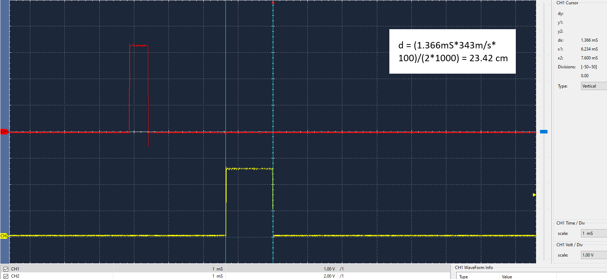

# Urbanite Project

## Authors

* **Felipe Fernández-Arche** - email: [f.fernandez-arche@alumnos.upm.es](mailto:alumno@alumno.es)
* **David Pedraza** - email: [david.pedraza@alumno.upm.es](mailto:alumno@alumno.es)

This project demonstrates how the project Urbanite works using an ultrasound transceiver to measure the distance to an object in a parking aid system mounted on a car. It uses a finite state machine (FSM) to control the ultrasound sensor, a display (RGB LED) to show the distance, and a button to interact with the system.

Este proyecto demuestra cómo funciona el proyecto Urbanite utilizando un transceptor de ultrasonidos para medir la distancia a un objeto en un sistema de asistencia de estacionamiento montado en un automóvil. Emplea una máquina de estados finitos (FSM) para controlar el sensor de ultrasonidos, una pantalla (LED RGB) para mostrar la distancia y un botón para interactuar con el sistema.

## Version 1

In Version 1, the system works with the user button only. The user button is connected to the pin PC13. The code uses the EXTI13 interrupt to detect the button press.

| **Parameter** |      **Value**       |
| ------------- | -------------------- |
| Pin           | PC13                 |
| Mode          | Input                |
| Pull up/ down	| No push no pull      |
| EXTI	        | EXTI13               |
| ISR           | EXTI15_10_IRQHandler |
| Priority	    | 1                    |
| Subpriority	| 0                    |
| Debounce time | 100-200 ms           |

## Version 2

In Version 2, the system adds the ultrasonic transceiver to measure the distance to an object. The trigger pin is connected to the pin PB0, and the echo pin is connected to the pin PA1. The code uses the TIM2, TIM3 and TIM5 timers to control the ultrasonic transceiver.

To measure the distance in centimeters with a timer resolution of 1 microseconds, we can say that 1 cm is equivalent to 58.3 microseconds. The speed of sound is 343 m/s at 20ºC. The ultrasonic transceiver is the HC-SR04.

The characteristics and connections of the ultrasonic transceiver HC-SR04 are shown in the table below:

|   **Parameter**   |                      **Value**                      |
| ----------------- | --------------------------------------------------- |
| Power supply      | 5 V                                                 |
| Current           | 15 mA                                               |
| Angle of aperture | 15º                                                 |
| Frequency         | 40 kHz                                              |
| Measurement range	| 2 cm to 400 cm                                      |
| Pins              | PB0 (Trigger) and PA1 (Echo)                        |
| Mode	            | Output (Trigger) and alternative (Echo)             |
| Pull up/ down	    | No pull                                             |
| Timer             | TIM3 (Trigger) and TIM2 (Echo)                      |
| Channel	        | (see the Alternate Function table in the datasheet) |

To **measure the echo time**, we will configure the timer TIM2 in **input capture mode**, which will capture the value of the counter at the moment the echo signal is activated and deactivated.

| **Parameter** |               **Value**               |
| ------------- | ------------------------------------- |
| Timer         | TIM2                                  |
| Prescaler     | (to be calculated for 1 microseconds) |
| Period        | (to be calculated for 1 microseconds) |
| ISR           | `TIM2_IRQHandler()`                   |
| Priority   	| 3                                     |
| Subpriority   | 0                                     |

The timer that controls the **timeout between consecutive measurements** is TIM5. The characteristics of this timer are shown in the table below. The FSM will give a value every PORT_PARKING_SENSOR_TIMEOUT_MS milliseconds.

| **Parameter** |                        **Value**                        |
| ------------- | ------------------------------------------------------- |
| Timer         | TIM5                                                    |
| Prescaler     | (to be calculated for 1 PORT_PARKING_SENSOR_TIMEOUT_MS) |
| Period        | (to be calculated for 1 PORT_PARKING_SENSOR_TIMEOUT_MS) |
| ISR           | `TIM5_IRQHandler()`                                     |
| Priority   	| 5                                                       |
| Subpriority   | 0                                                       |

## Version 3

In Version 3, the system adds the display, which is an RGB LED. The RGB LED is connected to the pins PB6 (red), PB8 (green), and PB9 (blue). The code uses the TIM4 timer to control the frequency of the PWM signal for each color. The RGB LED will show the distance to the object detected. The characteristics of the display are shown in the table below.

|    **Parameter**     |                      **Value**                      |
| -------------------- | --------------------------------------------------- |
| Pin LED red          | PB6                                                 |
| Pin LED green        | PB8                                                 |
| Pin LED blue         | PB9                                                 |
| Mode                 | Alternative                                         |
| Pull up/ down        | No pull                                             |
| Timer                | TIM4                                                |
| Channel LED red      | (see the Alternate Function table in the datasheet) |
| Channel LED green    | (see the Alternate Function table in the datasheet) |
| Channel LED blue     | (see the Alternate Function table in the datasheet) |
| PWM mode             | PWM mode 1                                          |
| Prescaler            | (to be calculated for a frequency of 50 Hz)         |
| Period               | (to be calculated for a frequency of 50 Hz)         |
| Duty cycle LED red   | (variable, depends on the color to show)            |
| Duty cycle LED green | (variable, depends on the color to show)            |
| Duty cycle LED blue  | (variable, depends on the color to show)            |

The following table shows the duty cycle values for each color in function of the distance. Be careful, these values are not the ones that you put in the **CCRx register!** They depend on the PORT_DISPLAY_RGB_MAX_VALUE. The values are shown in the table below.

## Version 4

In Version 4 the system completes its FSM to interact with the user button, the ultrasonic transceiver, and the display. The system will show the distance to the object detected in the display.

## Version 5

**Brief description of version 5:**

First, we changed the RGB display conditions from discrete to continuous, which is noticeable in the transition between red and green.
Next, we implemented the debounce time as a hardware feature of the button, requesting it from the PORT.
Finally, we made the LED blink—faster when the distance is shorter, and slower when it's longer.

**Breve descripción de la versión 5:**

Primero hemos hecho que las condiciones del display RGB pasen de ser discretas a continuas, notándose en el paso entre el rojo y verde.
Después hemos metido el tiempo de anti-rebotes como característica HW del botón, pidiéndosela al PORT.
Por último, hemos implementado que el LED parpadee, con más frecuencia cuando la distancia es menor, y más lento cuando es mayor.
